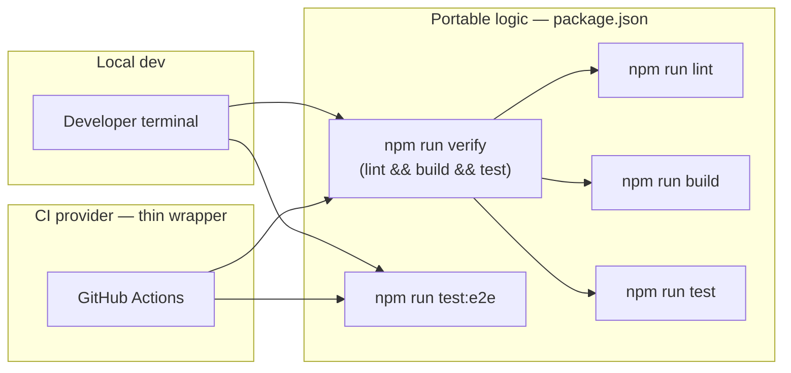

# CI Workflow

This document explains how CI is structured in this template and why it is
designed to stay independent of any specific CI provider.

## The problem

CI configuration files tend to accumulate provider-specific logic: which
linter to run, in what order, with which flags, how to install dependencies,
how to decide if the build passed. When that logic lives inside
`.github/workflows/*.yml` (or `.gitlab-ci.yml`, or a Jenkinsfile), migrating to
a different provider — or even just running the same checks locally — means
reverse-engineering and reimplementing that logic somewhere else.

## The design: npm scripts own the logic

All actual verification logic lives in `package.json` scripts, not in the
workflow file. The workflow file's only job is to provision an environment
and call those scripts.



A developer runs `npm run verify` locally before pushing and gets the exact
same result CI will get. There is no drift between "what CI checks" and "what
I can check on my machine."

## What lives in `package.json`

```jsonc
"scripts": {
  "lint": "npm run lint --workspaces --if-present",
  "build": "npm run build --workspaces --if-present",
  "test": "npm run test --workspace @template/backend",
  "test:e2e": "npm run test:e2e --workspace @template/backend",
  "verify": "npm run lint && npm run build && npm run test"
}
```

`verify` composes the existing scripts instead of duplicating their logic.
Adding a new workspace-level check (frontend unit tests, a type-check step,
etc.) means editing this one script — every CI provider picks it up for free.

## What stays in the workflow file

[.github/workflows/ci.yml](../.github/workflows/ci.yml) only handles things
that are inherently tied to the CI provider — provisioning, not verification:

- Checking out the repository
- Installing the correct Node version (read from [.nvmrc](../.nvmrc))
- Caching `node_modules`
- Spinning up a disposable Postgres service for the `e2e` job
- Deciding on which events the pipeline triggers (push to `main`, pull requests)

None of that is business logic. If this template's CI ever needs to move to
GitLab CI, CircleCI, or anything else, only this provisioning layer needs to
be rewritten — the equivalent of:

```yaml
# GitLab CI sketch — same npm scripts, different provisioning syntax
verify:
  image: node:24
  script:
    - npm ci
    - npm run verify
```

```yaml
# CircleCI sketch — same npm scripts, different provisioning syntax
jobs:
  verify:
    docker:
      - image: cimg/node:24.0
    steps:
      - checkout
      - run: npm ci
      - run: npm run verify
```

The `verify` and `test:e2e` scripts themselves never change.

## Two jobs, two different needs

- **`verify`** — lint, build, and unit tests. These are pure and mocked (see
  [messages.service.spec.ts](../apps/backend/src/messages/messages.service.spec.ts)),
  so this job needs nothing but Node and `npm ci`.
- **`e2e`** — exercises the real HTTP layer against a real database
  ([app.e2e-spec.ts](../apps/backend/test/app.e2e-spec.ts)), so it provisions
  a throwaway Postgres service container, runs `db:setup` (ensure database +
  migrate + seed) against it, then runs `test:e2e`. This is the one piece of
  provisioning that isn't just "install Node" — every CI provider has its own
  way to run a sidecar service, so expect to rewrite this part specifically
  when switching providers.

## Adding a new check

1. Add or wire the check as an npm script (workspace-level or root-level).
2. If it should block merges by default, add it to `verify` (or to the `e2e`
   job, if it needs infrastructure like a database).
3. Nothing in the workflow file needs to change unless the check needs new
   provisioning (a new service container, a new secret, a new tool
   installed in the runner).
